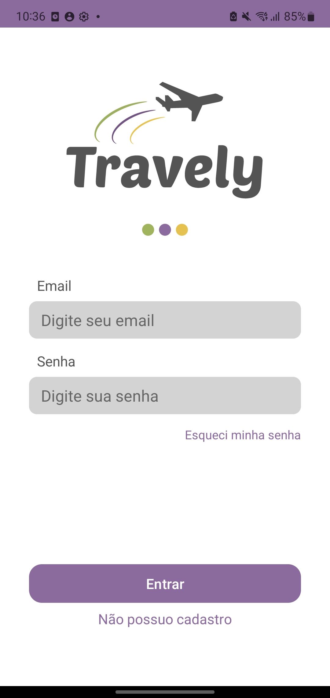
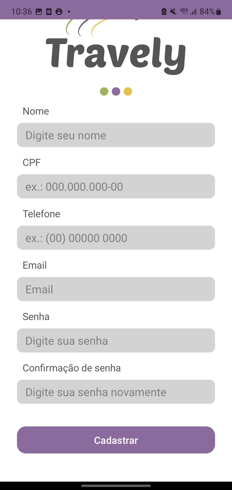
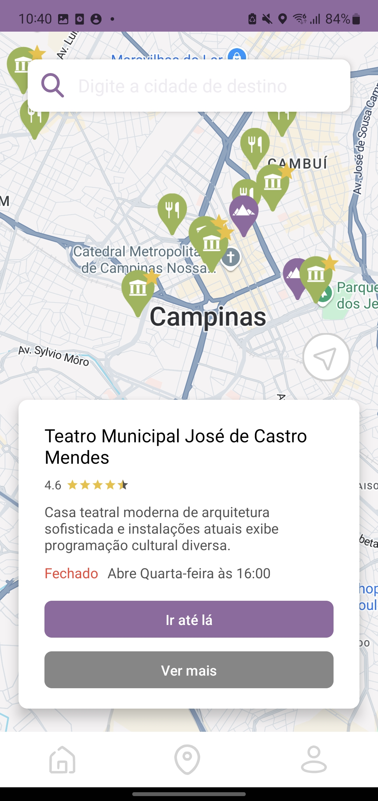

# TRAVELY

Travely é um aplicativo de turismo desenvolvido para oferecer uma experiência única e personalizada para viajantes. Com ele, é possível explorar locais turísticos, organizar sua agenda e planejar sua próxima viagem com facilidade.

## Funcionalidades

1.  **Cadastro e Perfil de viagem**

    - Crie sua conta para acessar o aplicativo
    - Escolha seu perfil de viagem

        <p>
              
            
            
        </p>

2.  **Exploração no Mapa**
    - Visualize os pontos turísticos no mapa.
    - Clique em um local para obter informações detalhadas ou navegar até o local diretamente via integração com Google Maps.

        <p>
            
        </p>

3.  **Compra de Ingressos**
    - Reserve ingressos para atrações ou eventos diretamente pelo aplicativo.

        <p>
            
            
        </p>

4.  **Agenda**
    - Salve os locais que deseja visitar na agenda e organize seus passeios.

        <p>
            
        </p>

## Como Usar

1. **Clone o repositório:**

```bash
git clone https://github.com/nahsumida/Travely.git
```

2. **Configure os projetos:**

   - Abra o projeto do servidor em `travely-server-java` e execute o arquivo `BookingManagerServer`.
   - Abra o projeto do aplicativo em `travely` no Android Studio.

3. **Configure as chaves de API:**
   - Insira sua chave da Google Maps API no arquivo local.properties do projeto Android.

```bash
GOOGLE_MAPS_API_KEY=sua_chave
```

5. **Compile e execute:**
   - Execute o servidor e, em seguida, o aplicativo em um dispositivo físico ou emulador.

## Tecnologias Utilizadas

- **Linguagens de Programação:** Kotlin (App Android) e Java (Servidor).
- **Desenvolvimento de Interface:** XML
- **Banco de dados:** Firebase

## Equipe

- [Emilly Ferro Bó](https://github.com/emillyfb21) RA: 23001239
- [Isabella Maria Tressino Bruno](https://github.com/jessicakushidaa) RA: 23013050
- [Izabelle de Oliveira Silva](https://github.com/IzabelleOliveira) RA: 23001444
- [Jéssica Silva Kushida](https://github.com/jessicakushidaa) RA: 23012069
- [Natália Naomi Sumida RA](https://github.com/nahsumida): 23008255
